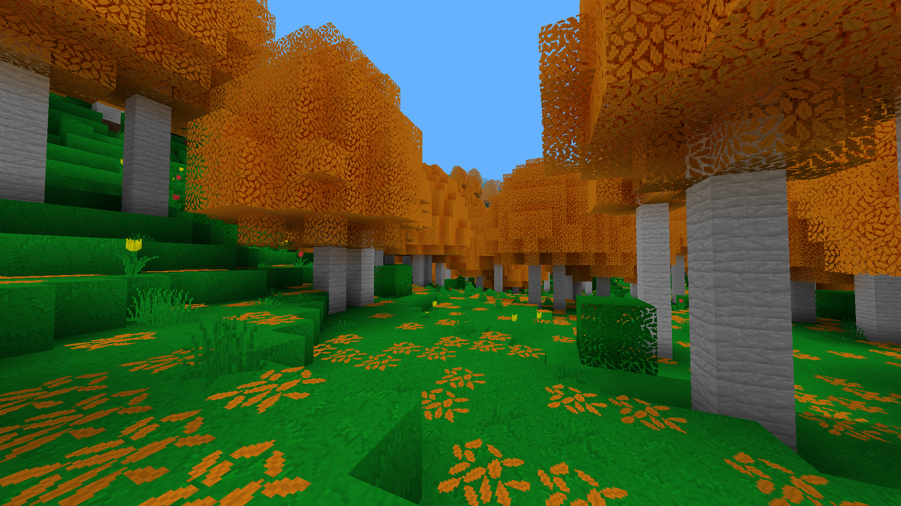

# LAB

[More screenshots](screenshots/screenshots.md)

A Voxel-Engine, *infinite* world in all three spacial dimensions. Currently
work in progress. After the main engine has been written, custom modding
support gets added, for custom blocks etc... (Thats how the content should be
added).

## Building
To build LAB follow the instructions [here](setup-dev.md)

## Documentation
The documentation can be found [here](doc/table.md).

### *"Blog"*
[Template Headers](doc/topic-template-headers.md)

## The language choice: C

Why do I use C for this project? For me its a clean and timeless language.
For many others it might not be the first choice, maybe C++ or Rust is 
preferred. Anything you can do in those languages you can do in C too. It
might not be clear at first how to do it, and you might need to do many things
from scratch. But you can create a clean design using OOP design patterns.
You can think about it, as if the syntax in C is a little different. Instead
of a `class` with nested functions, you use `structs` and global functions,
where the first parameter is a pointer to the object (the struct). Even
interfaces are possible in C, you either use function pointers or you declare
a struct with function pointers that correspond to the interface methods.

**Even if GitHub comes up with C++ or Objective C, the project is completely C.**
GitHub might be fooled by the use of template-headers, which involves a special
syntax of declaring functions, that is completely based on the C-Preprocessor.
The only thing that is not pure C is the use of GCCs attributes and builtins,
which can even be used with Clang. When compiling with any other compiler,
the attributes and builtins are disabled and replaced by a pure C alternative:
either by nothing or by an (inline) implementation.

The python script [`xmd.py`](xmd.py) comes from one of my other repositories
[XMD](https://github.com/manuel-fischer/XMD) and generates the markdown files
of the [documentation](doc/table.md)
