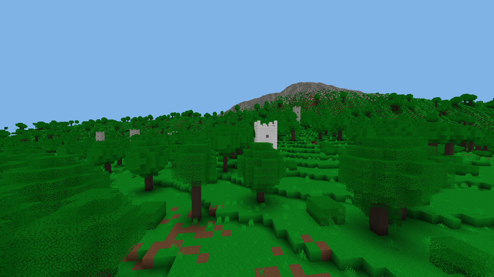

# LAB

[More screenshots](screenshots/screenshots.md)

A Voxel-Engine, *infinite* world in all three spacial dimensions. Currently
work in progress. After the main engine has been written, custom modding
support gets added, for custom blocks etc... (Thats how the content should be
added).

## Building
To build LAB follow the instructions [here](setup-dev.md)

## The language choice: C

Why do I use C for this project? For me its clean compared to other commonly
used languages. It forces you to write simpler code, that does not hide parts
of the code, that are important.  

### Template headers/Template sources
In combination with the C-Preprocessor you can define Generic Datastructures
in C. That is done by special header files, which I call template headers
and template sources. Before including these you provide a set of parameters,
that describe the content type and other configuration of the datastructure.
A template header and a template source should only be included once per given
parameter set. Eg. the template header is included in a header file, the
template source is included in the corresponding source file. The header file
should be guarded (`#ifndef #define #endif` or `#pragma once`), so that the
ODR (One definition rule) is not broken. The macro `HTL_DEF` could be defined
with `inline` so that the template source can be included in a header. Note
that both the template header and the template source need to be included for
a given parameter set. A parameter set is selected by defining `HTL_PARAM`
with the corresponding identifier prefix of the defined parameters. After
the include it is recommended to undefine `HTL_PARAM` again. The identifier
prefix of the parameters could be the name of the structure to be defined.
It should not be a macro that maps to something other than itself.

**Even if GitHub comes up with C++ or Objective C, the project is completely C.**
GitHub might be fooled by the use of template-headers, which involves a special
syntax of declaring functions, that is completely based on the C-Preprocessor.
The only thing that is not pure C is the use of GCCs attributes and builtins,
which can even be used with Clang. When compiling with any other compiler,
the attributes and builtins are disabled and replaced by a pure C alternative:
either by nothing or by an (inline) implementation.
