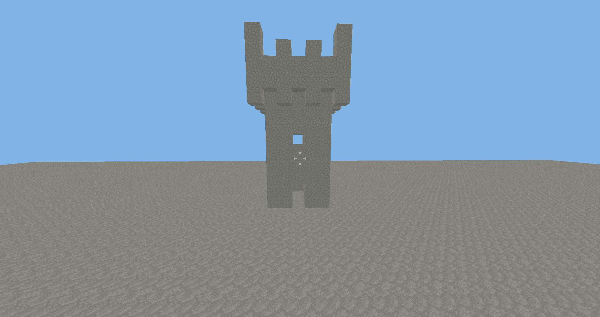

# Screenshots
More recent screenshots are at the top, so if you want to see the developement stages from early on, you can start at the bottom and scroll up.

## New cave generation

## Cave with Surface Entrance

## Grassy terrain generation

Grassy terrain with smooth lighting

## Colored Lighting

A cave with colorful crystals

A white and a blue light source, smooth lighting is enabled

a bunch of different light sources, smooth lighting was not implemented when this screenshot was taken

## Grassy terrain generation

## First cave generation

## Colored Lighting

Colored lighting was implemented partly, but disabled through an `#if 0`-block

## First Terrain generation

## Early images

